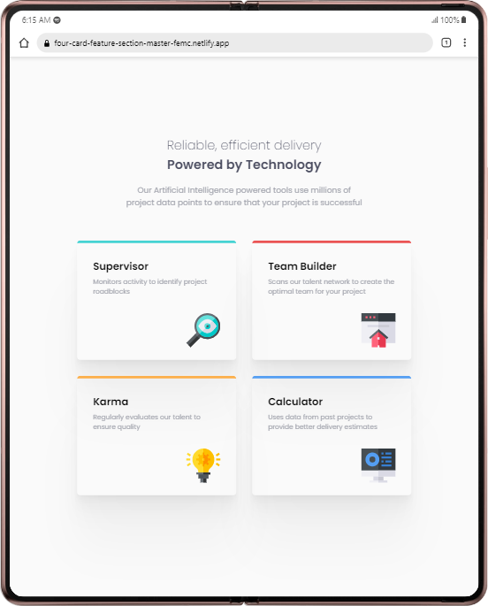
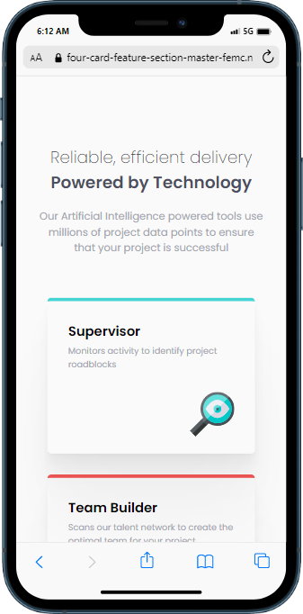

# Frontend Mentor - Four card feature section solution

This is a solution to the [Four card feature section challenge on Frontend Mentor](https://www.frontendmentor.io/challenges/four-card-feature-section-weK1eFYK). Frontend Mentor challenges help you improve your coding skills by building realistic projects. 

## Table of contents

- [Overview](#overview)
  - [The challenge](#the-challenge)
  - [Screenshot](#screenshot)
  - [Links](#links)
- [My process](#my-process)
  - [Built with](#built-with)
  - [What I learned](#what-i-learned)
  - [Useful resources](#useful-resources)
- [Author](#author)

**Note: Delete this note and update the table of contents based on what sections you keep.**

## Overview

### The challenge

Users should be able to:

- View the optimal layout for the site depending on their device's screen size

### Screenshot

### Links

- Solution URL: [Click here](https://www.frontendmentor.io/solutions/responsive-four-card-feature-section-KIDevV9VEn)
- Live Site URL: [Click here](https://four-card-feature-section-master-femc.netlify.app/)

## My process

### Built with

- Semantic HTML5 markup
- CSS custom properties
- Flexbox
- CSS Grid
- Mobile-first workflow

### What I learned

This challenge was yet another opportunity for me to practice grid and also refresh my grid-layouting skills. Little but worth it!

### Useful resources

- [Philipp Brumm's Shadow Tool](https://shadows.brumm.af/) - I used this to generate the box-shadow below the cards. I really liked this pattern and will use it going forward.

## Author

- Frontend Mentor - [@xyzeez](https://www.frontendmentor.io/profile/xyzeez)
- Twitter - [@abdusamii_](https://twitter.com/abdusamii_)

